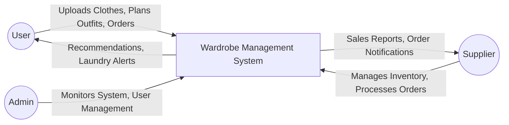
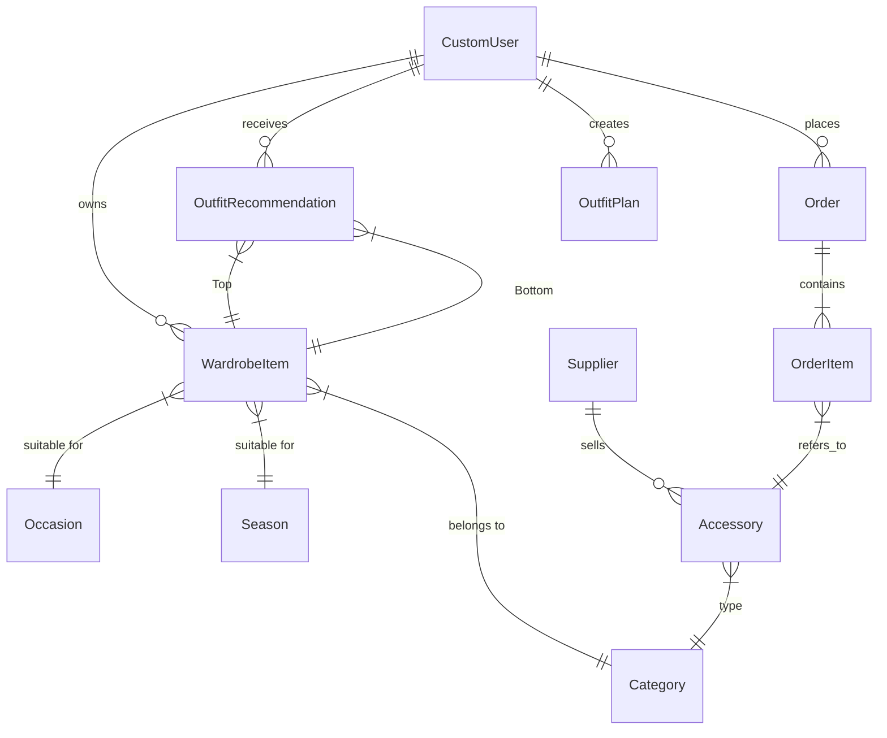

# 👗 Wardrobe Management System - Technical Documentation

## 1. Project Overview
The **Wardrobe Management System** is a full-stack Django web application designed to digitize and manage personal wardrobes. It bridges the gap between closet organization, outfit planning, and e-commerce.

**Core Value Propositions:**
*   **For Users:** Digitize wardrobe, track laundry usage, get AI-powered outfit recommendations based on color theory, plan outfits for future events, and buy matching accessories.
*   **For Suppliers:** A dedicated portal to list fashion accessories, manage inventory, and track orders.

---

## 2. System Architecture

The system follows the standard **Django MVT (Model-View-Template)** architecture, integrated with a lightweight Machine Learning layer for color analysis and recommendations.

```mermaid
graph TD
    User[User / Client Browser] <-->|HTTP Requests| Nginx[Web Server / Localhost]
    Nginx <-->|WSGI| Django[Django Framework]
    
    subgraph "Django Backend"
        Auth[Authentication System]
        Views[View Logic / Controllers]
        Models[ORM Models]
        Templates[HTML Templates]
        
        Views --> Auth
        Views --> Models
        Views --> Templates
    end
    
    subgraph "Data & Logic Layer"
        DB[(SQLite Database)]
        ML[ML Engine (Scikit-Learn)]
        Media[Media Files (Images)]
    end
    
    Models <--> DB
    Views --> ML
    Models --> Media
```

---

## 3. Data Flow Diagrams (DFD)

### 3.1. Level 0: Context Diagram
High-level interaction between entities and the system.



### 3.2. Level 1: User Wardrobe Flow
Detailed flow of how a user interacts with the wardrobe and recommendation features.

```mermaid
flowchart TD
    Start((Start)) --> Login[User Login]
    Login --> Dashboard[User Dashboard]
    
    Dashboard -->|Add Item| Upload[Upload Image]
    Upload --> Extract[ML: Extract Dominant Color]
    Extract --> SaveDB[(Save to Database)]
    
    Dashboard -->|Get Recommendation| RecEngine[Recommendation Engine]
    RecEngine --> Fetch[Fetch Clean Tops & Bottoms]
    Fetch --> Match[Calculate Match Score (Color Rules)]
    Match --> Display[Display Outfits]
    
    Display -->|Select| Plan[Plan for Date]
    Plan --> SavePlan[(Save to Planner)]
    
    Dashboard -->|Mark Worn| WearUpdate[Increment Wear Count]
    WearUpdate --> CheckLimit{Wear Limit Reached?}
    CheckLimit -- Yes --> MarkDirty[Set Clean Status = False]
    CheckLimit -- No --> UpdateCount[Update DB]
```

---

## 4. Database Schema

The database is designed using relational principles. Below is the Entity-Relationship Diagram (ERD) and detailed schema tables.

### 4.1. Entity Relationship Diagram (ERD)



### 4.2. Tabular Schema

#### **1. Users (`accounts_customuser`)**
| Field | Type | Constraints | Description |
| :--- | :--- | :--- | :--- |
| `id` | Integer | PK, Auto | Unique ID |
| `username` | Varchar | Unique | Login username |
| `role` | Varchar | Choices | `user`, `supplier`, `admin` |
| `email` | Varchar | - | User email |
| `profile_picture` | Image | Nullable | User avatar |
| `phone_number` | Varchar | Nullable | Contact number |

#### **2. Wardrobe Items (`wardrobe_wardrobeitem`)**
| Field | Type | Constraints | Description |
| :--- | :--- | :--- | :--- |
| `id` | Integer | PK, Auto | Unique ID |
| `user_id` | FK | `CustomUser` | Owner of the item |
| `item_type` | Varchar | - | Name/Description (e.g., "Blue Shirt") |
| `category_id` | FK | `Category` | Top, Bottom, Shoes, etc. |
| `color` | Varchar | - | Auto-extracted dominant color |
| `wear_count` | Integer | Default 0 | Times worn since last wash |
| `clean_status` | Boolean | Default True | `True` = Clean, `False` = Dirty |
| `price` | Decimal | Nullable | Cost of item |
| `purchase_date` | Date | Nullable | Date bought |

#### **3. Accessories (`accessories_accessory`)**
| Field | Type | Constraints | Description |
| :--- | :--- | :--- | :--- |
| `id` | Integer | PK, Auto | Unique ID |
| `supplier_id` | FK | `CustomUser` | Supplier who lists this item |
| `name` | Varchar | - | Product name |
| `price` | Decimal | - | Selling price |
| `stock` | Integer | - | Inventory count |
| `image` | Image | - | Product image |

#### **4. Orders (`orders_order`)**
| Field | Type | Constraints | Description |
| :--- | :--- | :--- | :--- |
| `id` | Integer | PK, Auto | Unique ID |
| `user_id` | FK | `CustomUser` | Buyer |
| `total_amount` | Decimal | - | Total cost of order |
| `status` | Varchar | Choices | `Ordered`, `Shipped`, `Delivered` |
| `payment_mode` | Varchar | Choices | `COD` (Cash on Delivery) |
| `address` | Text | - | Shipping address |

#### **5. Outfit Recommendations (`recommendations_outfitrecommendation`)**
| Field | Type | Constraints | Description |
| :--- | :--- | :--- | :--- |
| `id` | Integer | PK, Auto | Unique ID |
| `user_id` | FK | `CustomUser` | User receiving recommendation |
| `top_item_id` | FK | `WardrobeItem` | The upper body garment |
| `bottom_item_id` | FK | `WardrobeItem` | The lower body garment |
| `match_score` | Float | 0.0 - 1.0 | AI calculated compatibility score |
| `is_favorite` | Boolean | Default False | User saved favorite |

---

## 5. Detailed Module Description

### **5.1. Accounts Module (`apps.accounts`)**
*   Handles Authentication (Login, Register, Logout).
*   Manages Role-based access control (RBAC) using decorators (`@role_required`).
*   Profile management (Edit Bio, Address, Picture).

### **5.2. Wardrobe Module (`apps.wardrobe`)**
*   **CRUD Operations**: Users can Create, Read, Update, Delete clothing items.
*   **Laundry Logic**:
    *   Each category has a `max_wears` threshold (e.g., Jeans = 5, Shirts = 1).
    *   When `wear_count` >= `max_wears`, status flips to "Needs Laundry".
*   **Stats**: Calculates "Cost Per Wear" and visualizes wardrobe value.

### **5.3. Recommendations Module (`apps.recommendations`)**
*   **Color Analysis**: Uses `KMeans` clustering (via `sklearn`) to extract the dominant color from uploaded images.
*   **Matching Logic**:
    *   **Hardcoded Rules**: User-defined overrides (e.g., "I hate Red + Green").
    *   **ML/Heuristic**: General color theory compatibility scores.

### **5.4. Orders & Shop (`apps.orders`, `apps.accessories`)**
*   **Supplier Dashboard**: Suppliers can add products and view incoming orders.
*   **Shopping Cart**: Users can browse accessories that match their wardrobe colors.
*   **Checkout**: Simple checkout process with address capture and order generation.

### **5.5. Reminders & Planner (`apps.reminders`)**
*   **Outfit Planner**: Allows users to assign a specific `OutfitRecommendation` to a future calendar date.
*   **Laundry Reminders**: (Future) Automated emails/notifications for dirty laundry.

---

## 6. Installation & Setup

### Prerequisites
*   Python 3.8+
*   Pip
*   Virtualenv (Recommended)

### Steps

1.  **Clone the Repository**
    ```bash
    git clone <repository_url>
    cd Wardrobe_Management
    ```

2.  **Create Virtual Environment**
    ```bash
    python -m venv venv
    source venv/bin/activate  # Mac/Linux
    # venv\Scripts\activate   # Windows
    ```

3.  **Install Dependencies**
    ```bash
    pip install -r requirements.txt
    ```

4.  **Apply Migrations**
    ```bash
    python manage.py makemigrations
    python manage.py migrate
    ```

5.  **Create Superuser**
    ```bash
    python manage.py createsuperuser
    ```

6.  **Run Server**
    ```bash
    python manage.py runserver
    ```

Access the app at `http://127.0.0.1:8000/`

---

## 7. Future Enhancements

*   **Payment Gateway Integration**: Stripe or PayPal for real transactions.
*   **Weather Integration**: Recommend outfits based on live weather data (API).
*   **Social Features**: Share outfits with friends or a public feed.
*   **Mobile App**: React Native wrapper for mobile access.
